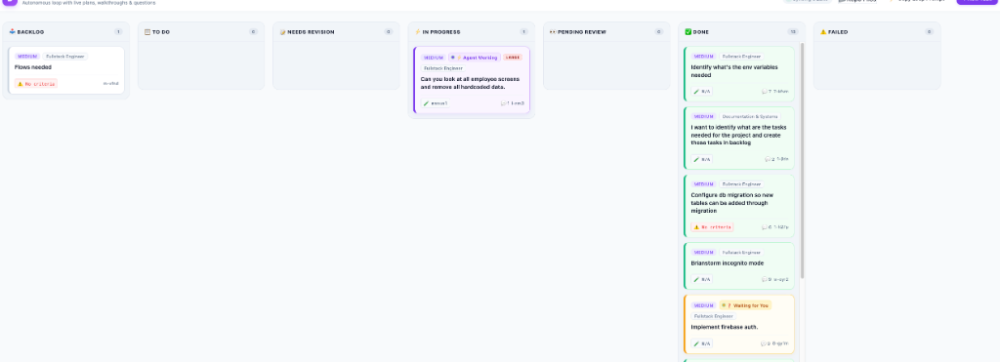
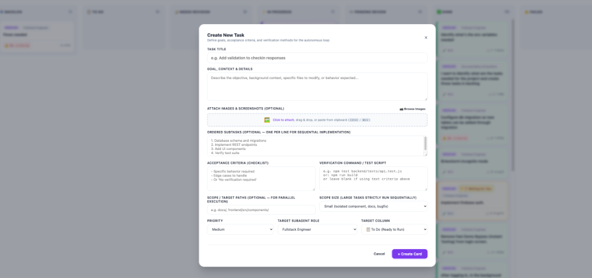

# Antigravity Taskboard Plugin

An autonomous engineering supervisor and Trello-style Kanban board plugin for **Google Antigravity**.

Provides continuous task loop orchestration with **project-scoped SQLite persistence**—allowing you to track, schedule, and run subagents completely inside Antigravity without external daemons or SDKs.

---

## 📸 Screenshots & UI Examples

### 1. Autonomous Kanban Taskboard
A live, responsive drag-and-drop board tracking subagent tasks across the entire engineering lifecycle: **Backlog**, **To Do**, **Needs Revision**, **In Progress**, **Pending Review**, **Done**, and **Failed**. Cards feature real-time status badges (`⚡ Agent Working`, `❓ Waiting for You`), target subagent roles, priority tags, subtask progress meters, verification criteria indicators, and parallel execution scope size pills (`SMALL`, `MEDIUM`, `LARGE`).



### 2. Structured Task Specification Modal
Define tasks with pre-execution acceptance criteria checklists, automated verification test scripts, ordered subtasks for sequential execution, image/screenshot attachments (via clipboard paste or drag & drop), and parallel execution scope boundaries.



---

## ⚡ Core Features

* **Pre-Execution Verification Gate**: Ensures subagents never write untested code or make assumptions without explicit criteria, automated test commands, or an explicit exemption.
* **Scope-Aware Parallel Execution**: Automatically detects file conflicts and scope size. Disjoint small/medium tasks run in parallel, while large tasks and database migrations execute strictly sequentially.
* **Pending Review File Locks**: Files modified by tasks currently waiting in **`👀 Pending Review`** remain locked until user sign-off.
* **Needs Revision Feedback Loop**: Completed tasks can be reopened to **`📝 Needs Revision`** with 1-click comment feedback, prioritized ahead of new backlog tasks.
* **SQLite BLOB Image Attachments**: Paste screenshots directly from clipboard (<kbd>Ctrl+V</kbd> / <kbd>⌘+V</kbd>) or drag & drop images; automatically stored in SQLite and passed into agent context.
* **Native Repository File Viewer (`/repo/*`)**: Browse project directories, preview Markdown docs with breadcrumbs, and inspect syntax-highlighted code files directly from task comments.
* **Token-Efficient Delta Polling (`poll`)**: Recurring cron wakeups inspect SQLite read-receipt flags (`processed_by_agent`) and return in ~4 tokens when idle.
* **1-Hour Auto-Termination**: Automatically terminates the autonomous supervisor loop after 1 continuous hour of inactivity to conserve tokens.

---

## 🗄️ Multi-Project Architecture: Is SQLite Shared or Different?

**Each project gets its own separate SQLite database.**

* **Project-Scoped by Default**: When the plugin runs, it resolves the active project directory (`process.cwd()`) and connects to:
  ```text
  <PROJECT_ROOT>/.agents/taskboard/tasks.sqlite
  ```
* **Clean Isolation**:
  - `Project A` (e.g. `doraapp`) has its own backlog, bugs, and subagent logs.
  - `Project B` (e.g. `mobile-app`) has its own independent tasks and board.
  - No cross-contamination between repositories.
* **Custom Override**: If you ever want a single shared database across all repositories, set `TASKBOARD_DB_PATH=/path/to/shared.sqlite`.

---

## 📦 Directory Structure

```text
antigravity-taskboard/
├── plugin.json                 # Antigravity Plugin Manifest
├── README.md                   # Documentation & UI Examples
├── assets/                     # Screenshots & Media
│   └── screenshots/
│       ├── kanban-board.png
│       └── create-task-modal.png
├── skills/                     # Bundled Skills
│   └── task-loop/
│       └── SKILL.md            # Autonomous supervisor loop skill
├── rules/
│   └── AGENTS.md               # Safety bounds, parallel execution & verification rules
└── taskboard/                  # Shared Engine & Web UI
    ├── board.html              # Drag-and-drop Kanban Board
    ├── server.mjs              # Micro-server (Port 4040)
    ├── repo_viewer.mjs         # Repository file & code viewer
    └── tasks.mjs               # Project-scoped SQLite CLI & API
```

---

## 🚀 Quick Start in Any Project

### 1. Launch the Trello Board UI
```bash
node .agents/plugins/antigravity-taskboard/taskboard/server.mjs
```
Open **`http://localhost:4040`** in your browser. The board header will dynamically display your project's name.

### 2. Start the Continuous Loop
In your Antigravity conversation, simply type:
> *"Run the task loop"* or `/goal Run task loop`

Antigravity will:
1. Fetch the next task from the project's SQLite `todo` or `needs_revision` column.
2. Check for parallel candidates if small/medium and disjoint from active tasks.
3. Spawn a subagent in an isolated git branch (`Workspace: "branch"`).
4. Run automated verification commands or evaluate acceptance criteria.
5. Move the card to `👀 Pending Review` with a structured walkthrough for user sign-off.
6. Continue looping until all pending tasks are resolved.

---

## Installation

```bash
git clone https://github.com/svylabs/antigravity-taskboard.git .agents/plugins/antigravity-taskboard
```
