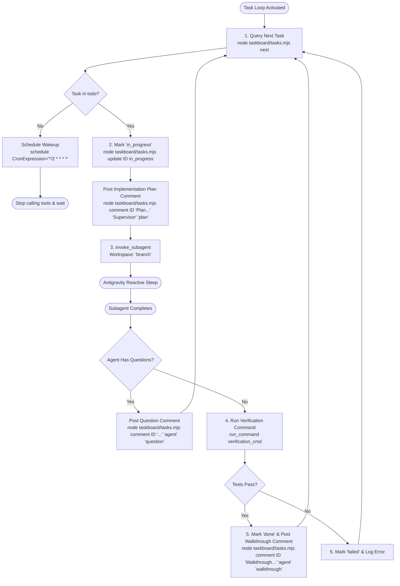

# Antigravity Task Loop Supervisor (Plugin Edition)

This skill equips Antigravity to act as an autonomous engineering supervisor. It monitors the project's local SQLite taskboard, posts **implementation plans**, **clarifying questions**, and **walkthroughs** as card comments, dispatches subagents in isolated git branches, verifies work, and updates the Trello board in real time.

---

## 1. Project-Scoped Storage & Collaboration

The plugin dynamically connects to the active workspace's SQLite database:
* Path: `<PROJECT_ROOT>/.agents/taskboard/tasks.sqlite`
* Multiple projects remain completely independent.
* Subagents and developers collaborate directly on task cards using comments.

---

## 2. Card Comments & Activity Feed API

Subagents and the supervisor can post 4 types of comments:
* `question` (❓ Amber callout): When requirements are ambiguous or user guidance is needed.
* `plan` (📋 Purple callout): High-level technical implementation approach before making code changes.
* `walkthrough` (🚀 Emerald callout): Post-completion summary of modified files and verification results.
* `comment` (💬 Slate note): General progress updates or logs.

CLI to add a comment:
```bash
node taskboard/tasks.mjs comment <TASK_ID> "<CONTENT>" "<AUTHOR>" "<TYPE>"
# Example:
node taskboard/tasks.mjs comment task-123 "What should the default retry timeout be?" "Subagent: Backend Engineer" "question"
```

---

## 3. Autonomous Execution Cycle



---

## 4. Execution Steps

### Step 1: Query Next Task
```bash
node .agents/plugins/antigravity-taskboard/taskboard/tasks.mjs next
```
* If `"found": true`: extract task fields and proceed to **Step 2**.
* If `"found": false`: no pending tasks. Register recurring cron via `schedule(CronExpression="*/2 * * * *", Prompt="Check taskboard for new tasks")` and suspend.

### Step 2: Claim Task & Post Plan
1. Mark card `in_progress`:
   ```bash
   node .agents/plugins/antigravity-taskboard/taskboard/tasks.mjs update <ID> in_progress "Subagent dispatched in branch"
   ```
2. Post brief implementation plan comment:
   ```bash
   node .agents/plugins/antigravity-taskboard/taskboard/tasks.mjs comment <ID> "Starting implementation: researching files and structuring branch changes." "Supervisor" "plan"
   ```
3. Spawn worker via `invoke_subagent`:
   * `Role`: task's `subagent_role`
   * `Workspace`: `"branch"` (safe git branch isolation)
   * `Prompt`: Title, Goal, Acceptance Criteria, Verification Command, and instructions to report any questions or blocking ambiguities.
4. Stop calling tools. Antigravity's **Reactive Wakeup** wakes the supervisor when the subagent finishes.

### Step 3: Handle Questions, Verification & Walkthrough
1. **If subagent raised questions or ambiguities**:
   Post the question as a comment:
   ```bash
   node .agents/plugins/antigravity-taskboard/taskboard/tasks.mjs comment <ID> "<QUESTION_TEXT>" "Subagent: <ROLE>" "question"
   ```
   Leave card in its current column with the `❓ Question` badge visible so the human user can answer it in the UI.
2. **If subagent completed implementation**:
   Update card status to `verification`.
   Run `verification_cmd` via `run_command` (e.g. `npm test` or `test -f <file>`).
   * If exit code 0:
     - Update task to `done`.
     - Post walkthrough comment:
       ```bash
       node .agents/plugins/antigravity-taskboard/taskboard/tasks.mjs comment <ID> "Verification succeeded. Implemented files: <FILES_LIST>." "Subagent: <ROLE>" "walkthrough"
       ```
   * If failed:
     - Update task to `failed` with error output.

### Step 4: Continue the Loop
Immediately return to Step 1 and continue until `todo` is empty.
