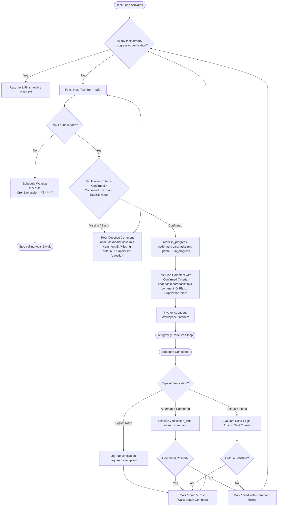

# Antigravity Task Loop Supervisor (Plugin Edition)

This skill equips Antigravity to act as an autonomous engineering supervisor. It monitors the project-scoped SQLite taskboard (`.agents/taskboard/tasks.sqlite`), enforces a **pre-execution verification gate** supporting commands, textual criteria, or explicit exemptions, ensures **strict single-task sequential execution**, and posts plans, questions, and walkthroughs as card comments.

---

## 🚨 Non-Negotiable Core Rules

1. **Pre-Execution Verification Gate**:
   Never begin implementing a task until its verification criteria are confirmed. Accepted formats:
   * **Automated Command** (`verification_cmd`, e.g. `npm test` or `npm run build`).
   * **Textual Criteria** (`acceptance_criteria`, e.g. bullet points of expected behavior, edge cases, and code rules to check against).
   * **Explicit Exemption**: If the card states *"no verification required"* or *"none"*.
   * If criteria are blank and no exemption is given, post a `question` comment and do not start.
2. **Complete One Task Before Moving to Another**:
   Never pick up a new task while another is in progress. The active task must complete its entire cycle (implementation $\to$ verification $\to$ marked `done` $\to$ walkthrough comment posted) before the next task can be claimed.
3. **Branch Isolation**:
   Always dispatch subagents in isolated git branches (`Workspace: "branch"`).

---

## Autonomous Execution Cycle



---

## Step-by-Step Instructions

### Step 1: Sequential Check & Fetch Next Task
1. Check if a task is already running:
   ```bash
   node .agents/plugins/antigravity-taskboard/taskboard/tasks.mjs active
   ```
   * **If an active task is running**: You must focus on completing and verifying that active task first before claiming any other task!
2. If no task is active, query the next task in `todo`:
   ```bash
   node .agents/plugins/antigravity-taskboard/taskboard/tasks.mjs next
   ```
   * **If `"found": false`**: No tasks in `todo`. Register recurring cron via `schedule(CronExpression="*/2 * * * *", Prompt="Check taskboard for new tasks")` and suspend.

---

### Step 2: Verification Gate Confirmation
Inspect `verification_cmd` and `acceptance_criteria`:

* **Case 1: Explicit Exemption**:
  - The card states *"no verification required"* or *"none"*.
  - Claim task, post plan comment citing the exemption, and spawn subagent.
* **Case 2: Automated Command**:
  - `verification_cmd` is specified (e.g. `npm test`, `test -f <file>`).
  - Claim task, post plan comment citing the command, and spawn subagent with instructions to ensure the command passes.
* **Case 3: Textual Verification Criteria**:
  - `acceptance_criteria` contains descriptive requirements (e.g. "Ensure modal closes on escape key and no direct backend imports").
  - Claim task, post plan comment summarizing the criteria checklist, and instruct the subagent to evaluate its work against each point.
* **Case 4: Completely Missing / Ambiguous**:
  - **DO NOT modify any code or spawn subagents.**
  - Post a `question` comment:
    ```bash
    node .agents/plugins/antigravity-taskboard/taskboard/tasks.mjs comment <ID> "Pre-execution Gate: No verification criteria provided. Please confirm automated command, textual checklist, or specify 'no verification required'." "Supervisor" "question"
    ```
  - Leave card in `todo` with the `❓ Question` badge visible and wait for user confirmation.

---

### Step 3: Verify & Complete Before Next Task
When the subagent finishes:
1. Update card status to `verification`.
2. Perform the verified evaluation:
   * **If automated command**: run it with `run_command`. Ensure exit code `0`.
   * **If textual criteria**: inspect modified files and evaluate that every item on the criteria checklist is met.
   * **If no verification required**: confirm changes are complete.
3. If verification passes:
   * Mark card `done`:
     ```bash
     node .agents/plugins/antigravity-taskboard/taskboard/tasks.mjs update <ID> done "Verification criteria satisfied."
     ```
   * Post walkthrough comment detailing changes and verification findings:
     ```bash
     node .agents/plugins/antigravity-taskboard/taskboard/tasks.mjs comment <ID> "Walkthrough: Verified changes against criteria. Modified files: <FILES>." "Subagent" "walkthrough"
     ```
4. If verification fails:
   * Mark card `failed` with specific failure notes.
5. **Only now that this task is completely finished**, proceed back to Step 1 for the next task.
