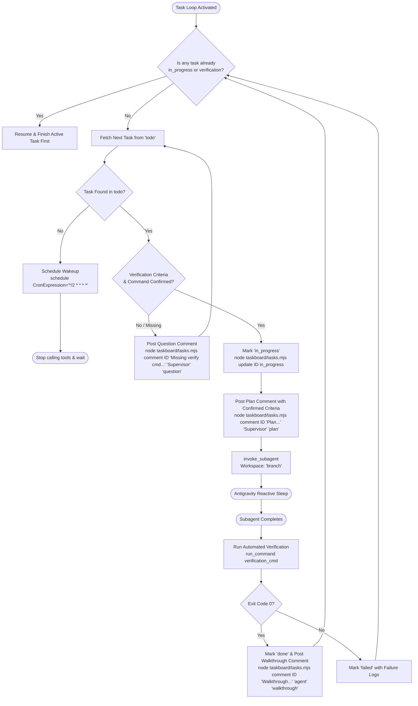

# Antigravity Task Loop Supervisor (Plugin Edition)

This skill equips Antigravity to act as an autonomous engineering supervisor. It monitors the project-scoped SQLite taskboard (`.agents/taskboard/tasks.sqlite`), enforces a **mandatory pre-execution verification gate**, ensures **strict single-task sequential execution**, and posts plans, questions, and walkthroughs as card comments.

---

## 🚨 Non-Negotiable Core Rules

1. **Pre-Execution Verification Gate**:
   Never begin implementing a task until its verification criteria and automated verification command (`verification_cmd`) are confirmed. If missing or ambiguous, post a `question` comment and do not start.
2. **Complete One Task Before Moving to Another**:
   Never pick up a new task while another is in progress. The active task must complete its entire cycle (implementation $\to$ verification $\to$ marked `done` $\to$ walkthrough comment posted) before the next task can be claimed.
3. **Branch Isolation**:
   Always dispatch subagents in isolated git branches (`Workspace: "branch"`).

---

## Autonomous Execution Cycle



---

## Step-by-Step Instructions

### Step 1: Sequential Check & Fetch Next Task
1. Check if a task is already running:
   ```bash
   node .agents/plugins/antigravity-taskboard/taskboard/tasks.mjs active
   ```
   * **If an active task is running**: You must focus on completing and verifying that active task first before claiming any other task!
2. If no task is active, query the next task in `todo`:
   ```bash
   node .agents/plugins/antigravity-taskboard/taskboard/tasks.mjs next
   ```
   * **If `"found": false`**: No tasks in `todo`. Register recurring cron via `schedule(CronExpression="*/2 * * * *", Prompt="Check taskboard for new tasks")` and suspend.

---

### Step 2: Mandatory Verification Gate
Before modifying any files or spawning a subagent, inspect the card's `verification_cmd` and `acceptance_criteria`:

* **Case A: Verification criteria are MISSING or AMBIGUOUS**:
  - **DO NOT spawn a subagent.**
  - Post a `question` comment on the card:
    ```bash
    node .agents/plugins/antigravity-taskboard/taskboard/tasks.mjs comment <ID> "Pre-execution Gate: Cannot begin implementation without confirmed verification criteria. Please provide or confirm an automated verification command (e.g. 'npm test <file>' or 'npm run build')." "Supervisor" "question"
    ```
  - Move to the next task or wait for user confirmation.

* **Case B: Verification criteria and command are CONFIRMED**:
  1. Claim the task:
     ```bash
     node .agents/plugins/antigravity-taskboard/taskboard/tasks.mjs update <ID> in_progress "Pre-execution gate passed. Verification command confirmed."
     ```
  2. Post implementation plan confirming the verification method:
     ```bash
     node .agents/plugins/antigravity-taskboard/taskboard/tasks.mjs comment <ID> "Implementation Plan: Starting work on branch. Confirmed verification command: '<VERIFICATION_CMD>'." "Supervisor" "plan"
     ```
  3. Spawn worker via `invoke_subagent`:
     * `Role`: task's `subagent_role`
     * `Workspace`: `"branch"`
     * `Prompt`: Goal, Acceptance Criteria, and the exact `verification_cmd` the subagent must ensure passes.
  4. Stop calling tools to allow Antigravity's **Reactive Wakeup** to resume execution upon completion.

---

### Step 3: Verify & Complete Before Next Task
When the subagent finishes:
1. Update card status to `verification`.
2. Run `verification_cmd` using `run_command`.
3. If exit code is `0` (Success):
   * Mark card `done`:
     ```bash
     node .agents/plugins/antigravity-taskboard/taskboard/tasks.mjs update <ID> done "All verification criteria passed."
     ```
   * Post walkthrough comment:
     ```bash
     node .agents/plugins/antigravity-taskboard/taskboard/tasks.mjs comment <ID> "Walkthrough: Changes verified with '<VERIFICATION_CMD>'. Modified files: <FILES>." "Subagent" "walkthrough"
     ```
4. If verification fails:
   * Mark card `failed` with error logs.
5. **Only now that this task is complete**, proceed to Step 1 to pick up the next task.
