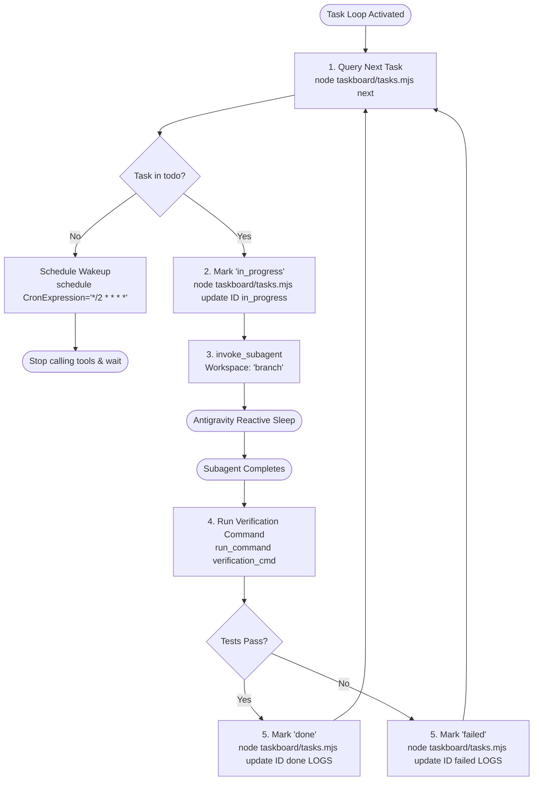

# Antigravity Task Loop Supervisor (Plugin Edition)

This skill equips Antigravity to act as an autonomous engineering supervisor for **any project** where this plugin is enabled. It monitors the project's local SQLite taskboard, dispatches subagents in isolated git branches, verifies their work, and updates the Trello board in real time.

---

## 1. Project-Scoped Storage

The plugin dynamically connects to the active workspace's SQLite database:
* Path: `<PROJECT_ROOT>/.agents/taskboard/tasks.sqlite`
* Multiple projects remain completely independent—each repository gets its own board and backlog.

---

## 2. Triggering the Loop

Activate this skill whenever the user asks to:
* *"Run the task loop"*
* *"Start continuous task loop"*
* *"Process next task"*
* Run slash command: `/goal Run task loop`

---

## 3. Autonomous Execution Cycle



---

## 4. Execution Steps

### Step 1: Query Next Task
```bash
node .agents/plugins/antigravity-taskboard/taskboard/tasks.mjs next
```
* If `"found": true`: extract task fields and proceed to **Step 2**.
* If `"found": false`: no pending tasks. Register recurring cron via `schedule(CronExpression="*/2 * * * *", Prompt="Check taskboard for new tasks")` and suspend.

### Step 2: Claim Task & Spawn Subagent
1. Mark card `in_progress`:
   ```bash
   node .agents/plugins/antigravity-taskboard/taskboard/tasks.mjs update <ID> in_progress "Subagent dispatched in branch"
   ```
2. Spawn worker via `invoke_subagent`:
   * `Role`: task's `subagent_role`
   * `Workspace`: `"branch"` (safe git branch isolation)
   * `Prompt`: Title, Goal, Acceptance Criteria, and Verification Command.
3. Stop calling tools. Antigravity's **Reactive Wakeup** wakes the supervisor when the subagent finishes.

### Step 3: Verification & Card Update
1. Update card status to `verification`.
2. Run `verification_cmd` via `run_command` (e.g. `npm test` or `test -f <file>`).
3. If exit code 0:
   * Update task to `done` with summary.
4. If failed:
   * Update task to `failed` with error output.

### Step 4: Continue the Loop
Immediately return to Step 1 and continue until `todo` is empty.
